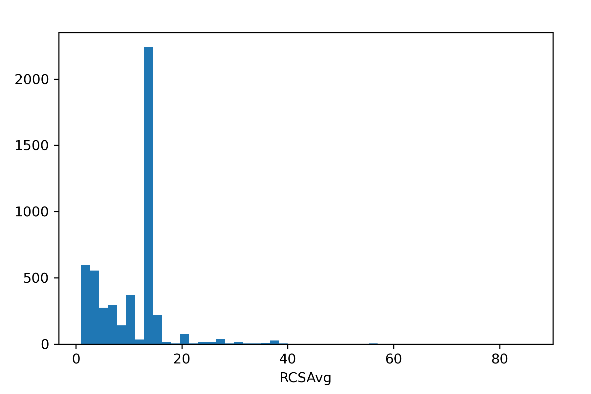
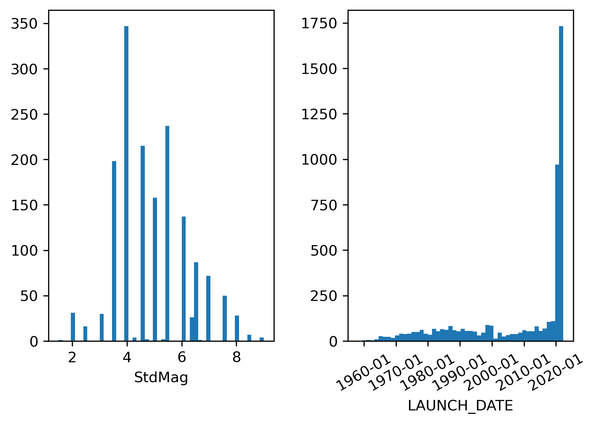
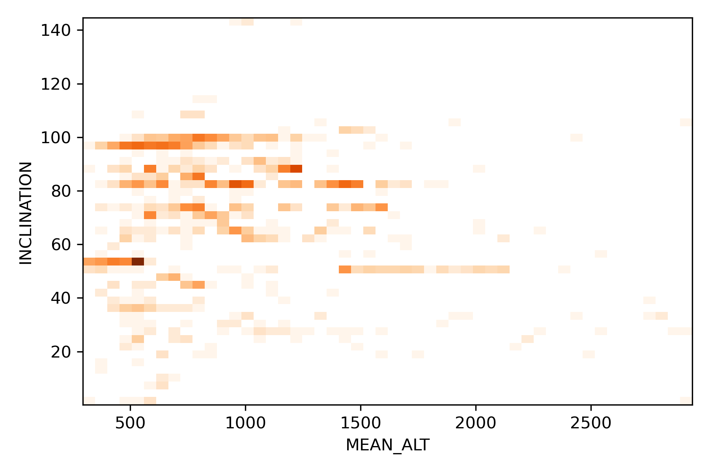
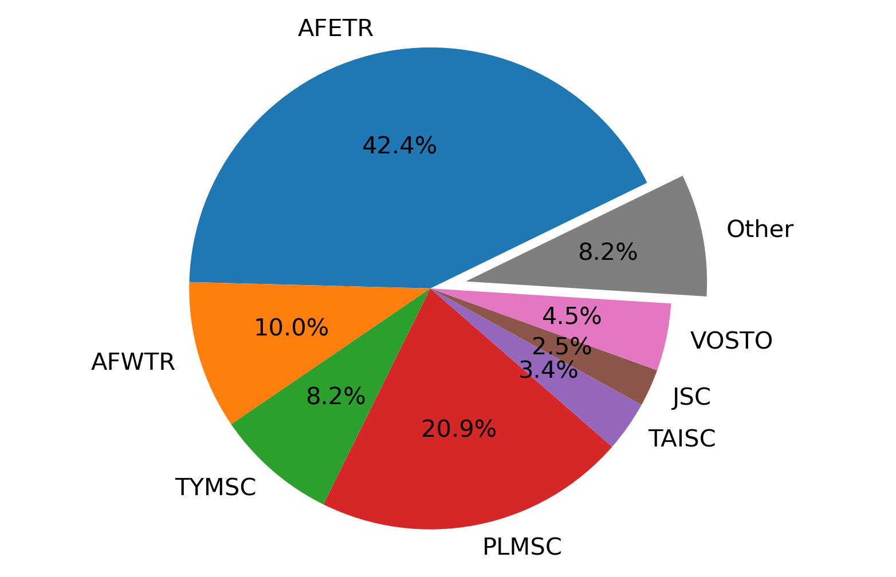

# Welcome to the SATQUERY package

[](https://pypi.python.org/pypi/satcatalogquery/) [](https://pypi.python.org/pypi/satcatalogquery/) [](https://pypi.python.org/pypi/satcatalogquery/) [](https://GitHub.com/lcx366/SATQUERY/graphs/contributors/) [](https://GitHub.com/lcx366/SATQUERY/graphs/commit-activity) [](https://github.com/lcx366/SATQUERY/blob/master/LICENSE) [](http://satcatalogquery.readthedocs.io/?badge=latest) [](https://travis-ci.org/lcx366/satcatalogquery)

This package is an archive of scientific routines for querying orbital and geometric information of space objects.
Currently, operations on objects catalogue query include:

1. Query of spatial objects on geometric information from DISCOS(Database and Information System Characterising Objects in Space) database;
2. Query of spatial objects on orbital information from CelesTrak database;
3. Query of spatial objects on both geometric and orbital information from a combined database;

## How to Install

On Linux, macOS and Windows architectures, the binary wheels can be installed using pip by executing one of the following commands:

```
pip install satcatalogquery
pip install satcatalogquery --upgrade # to upgrade a pre-existing installation
```

## How to use

### Objects catalogue query from DISCOS

Query by NORAD_ID, where type of NORAD_ID can be int/str, list of int/str,  or a text file named satno.txt in the following format:

```
# satno
52132
51454
37637
26758
44691
```

```python
>>> from satcatalogquery import SatCatalog
>>> satcatlog = SatCatalog.discos_query(NORAD_ID=[52132,51454,37637,26758,44691])
>>> # satcatog = SatCatalog.discos_query(NORAD_ID='satno.txt')
>>> satcatlog.df # output pandas dataframe
>>> satcatlog.to_csv() # save dataframe to .csv file
```

Query by mutiple options at the same time, such as COSPAR_ID, MASS, SHAPE, RCSAvg, etc.

```python
>>> satcatlog = SatCatalog.discos_query(SHAPE=['Box','Pan'],RCSAvg=[0.5,10],DECAYED=False)
```

#### Objects catalogue query from CelesTrak

```python
>>> satcatlog = SatCatalog.celestrak_query(MEAN_ALT=[300,2000],ECC=[0.01,0.1],PAYLOAD=False)
```

### Objects catalogue query from combined database

```python
>>> satcatlog = SatCatalog.objects_query(DECAYED=False,RCSAvg=[0.25,10],MEAN_ALT=[250,2000],TLE_STATUS=True,sort='RCSAvg')
```

### Create object `SatCatlog` from a loacl .csv file

```python
>>> from satcatalogquery import SatCatalog
>>> satcatlog = SatCatalog.from_csv('filename.csv')
```

### Statistics

```python
>>> satcatlog.hist1d('RCSAvg')
>>> satcatlog.hist1d(['StdMag','LAUNCH_DATE'])
>>> satcatlog.hist2d('MEAN_ALT','INCLINATION')
>>> satcatlog.pie('LAUNCH_SITE',cutoff=100)
```

<p align="middle">
  
</p>

<p align="middle">
  
</p>

<p align="middle">
  
</p>

<p align="middle">
  
</p>

### Download TLE from Space-Track according to the results of objects catalogue query

```python
>>> tle_path = satcatlog.get_tle()
```

### Download TLE from Space-Track by Norad IDs

```python
>>> from satcatalogquery import download_tle
>>> tle_file = download_tle([52132,51454,37637,26758,44691])
>>> print(tle_file)
```

## Change log

- **0.2.3 — Sep 23, 2023**
  
  - Fixed the bug that when downloading TLE data from SpaceTrack, the automatically generated wrong authentication file due to incorrect user name or password input could no longer be updated.

- **0.2.2 — Apr 24, 2023**
  
  - Change the method `.save()` to `.to_csv()` 
  
  - Add methods `.discos_query()`, `.celestrak_query()`, `.objects_query()`to class SatCatalog
  
  - Change class `SatCatlog` to `SatCatalog` 

- **0.2.1 — Jan 4, 2023**
  
  - Add method `from_csv` and `pie` to class SatCatlog
  
  - Add statistics figures to README.md

- **0.1.1 — Jan 2,  2023**
  
  - The ***satcatalogquery*** package was released.

## Reference

- [DISCOSweb](https://discosweb.esoc.esa.int)
- [CelesTrak](http://www.celestrak.com) and [SATCAT Format Documentation](https://celestrak.org/satcat/satcat-format.php)
- [Space-Track](https://www.space-track.org/auth/login)